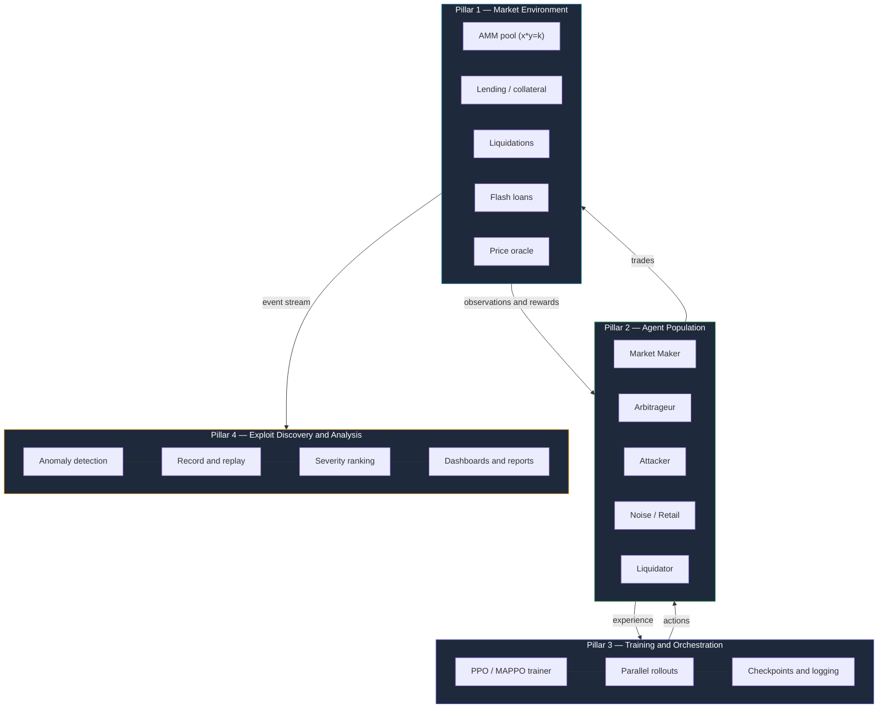

<div align="center">

# MARL for Market Simulation

### Multi-Agent Reinforcement Learning for Market Simulation and Automated Exploit Discovery

A crash-test facility for financial protocols. Hundreds of self-learning trading agents are released into a simulated market and, acting only to maximize their own profit, autonomously discover the economic exploits that would otherwise surface only after a protocol launches with real money.

<br/>

[](#roadmap)
[](#problem-statement)
[](#license)
[](https://www.python.org/)
[](https://pytorch.org/)
[](https://gymnasium.farama.org/)
[](https://pettingzoo.farama.org/)
[](https://docs.ray.io/en/latest/rllib/)

<br/>

**[Overview](#overview)** · **[Problem Statement](#problem-statement)** · **[Architecture](#architecture)** · **[Tech Stack](#tech-stack)** · **[Quickstart](#quickstart)** · **[Roadmap](#roadmap)** · **[Concepts](#core-concepts)**

</div>

---

> **New to the project?** This README is the technical overview. For the full, plain-English onboarding guide — every concept explained from first principles, no reinforcement-learning background assumed — read **[`GETTING_STARTED.md`](./GETTING_STARTED.md)** first.

---

## Overview

This project builds a high-fidelity simulator of a DeFi-style financial market and populates it with hundreds of independent reinforcement-learning agents. Each agent is given a single objective — **maximize its own profit** — and is never told *how* to achieve it.

Because the agents act selfishly and concurrently, they learn, on their own, to discover ways to break or exploit the market: price manipulation, cascading liquidations, flash-loan attacks, and oracle manipulation. These are strategies no human auditor explicitly scripted.

The objective:

> Surface these exploits inside a safe simulation **before** a real protocol launches with real money.

| Aspect | Summary |
|---|---|
| **What it is** | A market simulator paired with a swarm of self-learning RL agents |
| **What it does** | Automatically discovers economic exploits and systemic risks |
| **Who it serves** | Web3 protocol designers, DeFi teams, and quantitative risk desks |
| **Core technique** | Multi-Agent Reinforcement Learning (MARL) with PPO / MAPPO |
| **Flagship demo** | Simulate ten years of aggressive adversarial trading in an afternoon |

---

## Problem Statement

Financial markets — and decentralized exchanges in particular — are **complex adaptive systems**. A protocol may be mathematically sound on paper, yet behave unpredictably once thousands of strategic actors interact within it.

Traditional testing catches **bugs**. It does not catch **emergent economic exploits**, because those only appear when many strategic agents collide.

```
                    A protocol "proven correct on paper"
                                       |
            +--------------------------+--------------------------+
            v                                                     v
   Unit tests pass                          Thousands of profit-seeking agents interact
   Audit signed off                                       |
   Formal proof holds                                     v
            |                                    Flash-loan drain
            |                                    Liquidation cascade
            v                                    Oracle manipulation
       "Ship it."  ----------------------------> Value extracted
```

Real DeFi exploits have resulted in losses measured in billions. Protocol teams pay for manual audits that take weeks and still miss economic attacks. The core insight of this project:

> Instead of relying on humans to imagine every possible attack, let AI agents discover them automatically by playing the market millions of times.

### What the brief requires

The deep research component must:

1. Build a **high-fidelity, highly concurrent simulation environment** of a financial protocol.
2. Populate it with **hundreds of independent RL agents**, each with **slightly different reward functions** (market makers, arbitrageurs, aggressive attackers, and others).
3. Run them through **millions of generations** of training.
4. **Automatically discover complex, multi-step systemic exploits** before the protocol launches.

### Venture potential

An automated stress-testing platform for quantitative desks and Web3 protocols. The proposition: *upload your protocol's rules, and receive a ranked list of discovered exploits, complete with reproduction steps, after a simulation of years of adversarial market behavior.*

---

## Architecture

The system comprises four pillars, built in order. The approach is to deliver a minimal end-to-end slice first, then grow complexity from there.



<details>
<summary><b>ASCII fallback (if the diagram does not render)</b></summary>

```
+-------------------------------------------------------------------+
|                      ORCHESTRATION / TRAINING                      |
|   PPO trainer  .  parallel rollouts  .  checkpoints  .  logging    |
+---------------+-----------------------------------+----------------+
                | actions                           | obs + rewards
                v                                     ^
+-------------------------------+    +--------------------------------+
|        AGENT POPULATION        |   |     MARKET ENVIRONMENT (sim)    |
|  Market Maker . Arbitrageur    |<->|  AMM (x*y=k) . Lending          |
|  Attacker . Noise . Liquidator |   |  Liquidations . Flash loans     |
|   (PPO policies, het. rewards) |   |  Oracle . (Gymnasium/PettingZoo)|
+-------------------------------+    +----------------+---------------+
                                                      | event stream
                                                      v
                            +----------------------------------------+
                            |     EXPLOIT DISCOVERY & ANALYSIS         |
                            |  anomaly detection . replay . ranking    |
                            |  dashboards . charts . exploit reports   |
                            +----------------------------------------+
```
</details>

| Pillar | Name | Responsibility |
|:---:|---|---|
| **1** | Market Environment | Holds state (pool reserves, balances, loans), resolves actions via market rules, returns observations and rewards. Implements the **Gymnasium / PettingZoo** API. |
| **2** | Agent Population | RL policies trained with PPO. **Heterogeneous reward functions** produce diverse agent types. Scales to hundreds via parameter sharing. |
| **3** | Training and Orchestration | The training loop: collect experience, update policies, repeat for millions of steps. Manages parallelism, logging, and checkpoints. |
| **4** | Exploit Discovery | Detects exploit-like events, records and replays the causing action sequence, ranks events by severity, and visualizes results in a dashboard. This layer is what turns the system into a product. |

---

## Tech Stack

<table>
<tr>
<td valign="top" width="50%">

**Core RL and Multi-Agent**
- `Gymnasium` — standard single-agent environment API
- `PettingZoo` — the multi-agent counterpart
- `Ray RLlib` — industrial-scale MARL (MAPPO)
- `Stable-Baselines3` — readable PPO for prototyping

**Numerical and Performance**
- `NumPy` — array math for the simulator
- `PyTorch` — neural-network backend
- `JAX` *(stretch)* — GPU-vectorized environments

</td>
<td valign="top" width="50%">

**Data, Analysis, and Visualization**
- `Pandas` — logging and analysis
- `Matplotlib` / `Plotly` — charts and replays
- `TensorBoard` / `Weights & Biases` — run tracking
- `Streamlit` / `Dash` — the product dashboard

**Web3 Realism** *(later / stretch)*
- `Foundry` / `Anvil` or `Ganache` — a local chain to test exploits against real smart-contract code

</td>
</tr>
</table>

> **Recommended path:** prototype with **Stable-Baselines3 and Gymnasium** for speed of iteration, then graduate to **PettingZoo and Ray RLlib** for true multi-agent scale.

---

## Quickstart

> **Note:** the codebase is being built out (see [Roadmap](#roadmap)). These steps establish the toolchain and verify it end-to-end on a classic RL task — the first checkpoint before any market-specific code exists.

### 1. Create an isolated environment

```powershell
# From the project root
python -m venv .venv
.\.venv\Scripts\Activate.ps1
```

### 2. Install the starter stack

```powershell
pip install gymnasium "stable-baselines3[extra]" numpy pandas matplotlib tensorboard
```

### 3. Verify the toolchain

```python
# train_cartpole.py — trains a PPO agent in roughly two minutes.
# A reward curve that climbs toward 500 confirms the toolchain is working.
from stable_baselines3 import PPO

model = PPO("MlpPolicy", "CartPole-v1", verbose=1)
model.learn(total_timesteps=25_000)

import gymnasium as gym
env = gym.make("CartPole-v1", render_mode="human")
obs, _ = env.reset()
for _ in range(1_000):
    action, _ = model.predict(obs, deterministic=True)
    obs, reward, terminated, truncated, _ = env.step(action)
    if terminated or truncated:
        obs, _ = env.reset()
```

```powershell
python train_cartpole.py
```

### 4. Add the multi-agent stack (Phase 2 onward)

```powershell
pip install pettingzoo "ray[rllib]" plotly streamlit
```

With the toolchain verified, proceed to **[Phase 1](#roadmap)** and build the single-pool AMM environment.

---

## Roadmap

Development proceeds in vertical slices: a minimal end-to-end result first, with complexity added incrementally.

| Phase | Milestone | Status |
|:---:|---|:---:|
| **0** | Learn the concepts, set up the environment and libraries, train PPO on `CartPole` | In progress |
| **1** | **Minimal single-agent market** — one `x*y=k` AMM pool as a Gymnasium environment; one PPO agent learns to profit | Planned |
| **2** | **Multi-agent conversion** — move to PettingZoo, 2–5 agents, MAPPO; observe emergent competition | Planned |
| **3** | **Heterogeneous agents and richer market** — agent types, slippage, lending, liquidations, flash loans; scale to hundreds | Planned |
| **4** | **Exploit discovery layer** — anomaly detection, replay, severity ranking, Streamlit dashboard | Planned |
| **5** | **Scale and polish** — vectorization for millions of generations, exploit-report generator, showcase demo | Planned |

> **First substantive milestone:** Phase 1 — a single PPO agent whose reward curve climbs on a real AMM environment. Once that works end-to-end, the remaining work is iteration.

---

## Agent Types

Diversity of reward functions is what makes the simulated ecosystem realistic. The mix of agents is a primary design lever.

| Agent | Reward objective | Real-world analog |
|---|---|---|
| **Market Maker** | Profit from spread; rewarded for providing liquidity; penalized for large inventory swings | Liquidity providers |
| **Arbitrageur** | Profit from price differences across pools | Arbitrage bots |
| **Aggressive Attacker** | Pure profit, no risk aversion; willing to manipulate | Exploit hunters |
| **Noise / Retail** | Semi-random trades representing uninformed flow | Retail investors |
| **Liquidator** | Profit from liquidating under-collateralized positions | Liquidation bots |

---

## Core Concepts

A condensed reference. For full explanations with analogies and no assumed background, see **[`GETTING_STARTED.md`](./GETTING_STARTED.md) Section 4**.

<details>
<summary><b>Reinforcement Learning (RL)</b></summary>

Learning by trial and error to maximize a reward signal. The loop: an agent observes a state, selects an action, the environment changes and returns a reward, and the agent updates its policy — repeated many times.

Key terms: **State** (what the agent observes), **Action** (what it can do), **Reward** (the good/bad signal), **Policy** (its strategy, a neural network), **Episode** (one full run).
</details>

<details>
<summary><b>Multi-Agent RL (MARL)</b></summary>

Many agents learning in the same world simultaneously. This is substantially harder because the environment is **non-stationary**: from any single agent's perspective, the world keeps changing as other agents also learn. The market effectively *is* the other agents, and the resulting arms race is what surfaces realistic exploits.
</details>

<details>
<summary><b>PPO and MAPPO</b></summary>

**Proximal Policy Optimization** is a policy-gradient method that takes small, conservative steps so a single bad batch cannot derail a good policy. This stability is why it is the industry default. **MAPPO** is PPO adapted to multi-agent settings, often with a shared critic. The project uses established libraries rather than implementing PPO from scratch.
</details>

<details>
<summary><b>Automated Market Maker (x*y=k)</b></summary>

Most DeFi exchanges have no order book. A liquidity pool holds two assets and a formula sets the price. The classic **constant-product** rule requires that, for a pool holding `x` of token A and `y` of token B, the product `x * y = k` stays constant. Buying token A automatically raises its price. The formula is simple to implement and is where many DeFi exploits originate.
</details>

<details>
<summary><b>The exploits under investigation</b></summary>

- **Flash-loan attack** — borrow a large sum uncollateralized, manipulate a price, take profit, and repay, all within a single atomic transaction.
- **Cascading liquidations** — a sell-off drops a price, forcing liquidations, which dump more assets and drive the price lower, in a self-reinforcing collapse.
- **Oracle manipulation** — distorting the external price feed a protocol relies on.
- **Sandwich and front-running attacks** — exploiting the order in which trades are processed.
</details>

---

## Engineering Challenges

These are the recurring difficulties to plan around. A fuller treatment appears in [`GETTING_STARTED.md`](./GETTING_STARTED.md) Section 9.

1. **Non-stationarity.** All agents learn at once, so each chases a moving target. Mitigation: start with few agents, use PPO, apply parameter sharing, and expect noisy reward curves.
2. **Reward design.** Agents optimize exactly what is rewarded, including loopholes (reward hacking). Mitigation: keep rewards close to real profit and penalize degenerate strategies.
3. **Speed and scale.** Millions of generations across hundreds of agents is computationally demanding. Mitigation: vectorize, run parallel environments, and keep per-step logic cheap.
4. **Fidelity versus tractability.** Too simple a market yields no real exploits; too complex a market will not train. Mitigation: add one mechanic at a time.
5. **Identifying exploits.** Define measurable signatures, for example, extracting more than a set fraction of pool value within a bounded number of steps.
6. **Debuggability.** Diagnosing misbehavior across many agents is hard. Mitigation: build replay and visualization tooling early.

---

## Learning Resources

| Topic | Resources |
|---|---|
| **RL fundamentals** | OpenAI *Spinning Up in Deep RL*; Sutton & Barto, chapters 1–6; Hugging Face Deep RL Course |
| **PPO** | OpenAI PPO blog and Spinning Up; *The 37 Implementation Details of PPO* (ICLR) |
| **MARL** | PettingZoo documentation; Ray RLlib multi-agent and MAPPO examples |
| **DeFi mechanics** | Uniswap V2 whitepaper; Rekt.news exploit post-mortems |
| **Game theory** | An introductory explanation of Nash equilibrium |

---

## Project Structure

```
.
├── README.md            Technical overview (this file)
├── GETTING_STARTED.md   Full onboarding guide — read this first
├── PS.png               The original problem statement
└── ...                  Source code, added as phases are delivered
```

---

## About

Developed at **PESU Venture Labs** as a Deep AI, Web3, and FinTech research project. The guiding thesis:

> Artificial intelligence here is not about prediction. It is about simulating a complex, multi-actor ecosystem and studying the behavior that emerges.

**Domain:** Deep AI, Web3/Crypto, FinTech.
**Core concepts:** Multi-Agent Reinforcement Learning, game theory (Nash equilibria), concurrent system simulation, Proximal Policy Optimization.

---

## License

License **to be determined**. Until a license is added, all rights are reserved by the author(s).

---

<div align="center">

### Immediate Next Steps

1. Read [`GETTING_STARTED.md`](./GETTING_STARTED.md) Section 4 until the concepts are solid.
2. Set up Python and the starter stack, then train PPO on `CartPole` to verify the toolchain.
3. Build the Phase 1 single-pool AMM environment and train one agent on it.

<br/>

Start small, get something running, then grow it.

</div>
