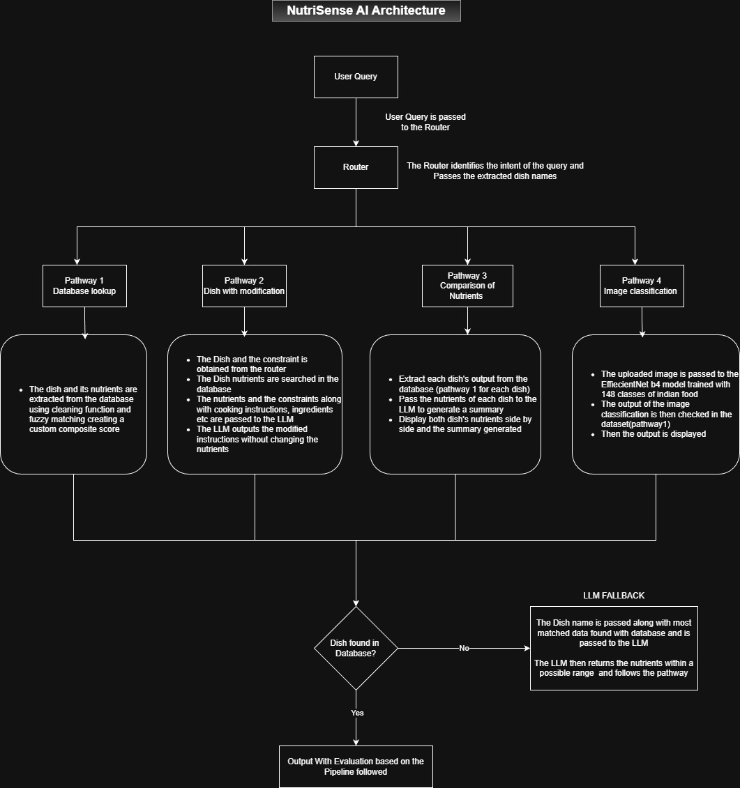

# NutriSense-AI


A comprehensive AI system analyzing Indian food recipes through database lookup, recipe modification, nutritional comparison, and image classification to provide dietary insights. Designed to provide accurate nutritional guidance for Indian cuisine with fallback estimation capabilities.

## Table of Contents

- [Overview](#overview)
- [Why This Matters](#why-this-matters)
- [Features](#features)
- [System Architecture](#system-architecture)
- [Dataset](#dataset)
- [Installation](#installation)
- [Usage](#usage)
- [Tech Stack](#tech-stack)
- [Model Performance](#model-performance)
- [Blogs](#blogs)
- [Future Enhancements](#future-enhancements)
- [Author](#author)
- [License](#license)

## Overview

NutriSense AI is an end-to-end AI system for analyzing Indian food nutrition using
database lookup, image classification, and intelligent recipe modifications.
It addresses the lack of accurate Indian food representation in commercial nutrition APIs.

The system unifies multiple data sources and AI techniques to provide:
- Database-driven lookups for 725+ curated recipes with complete nutritional profiles
- Intelligent image classification across 148 Indian dish categories
- AI-powered recipe modifications (e.g., "low-calorie version of Paneer Butter Masala")
- Multi-recipe comparison with optional nutritional summaries
- Fallback LLM estimation for out-of-database queries

## Why This Matters:

- Domain Gap: Indian cuisines are underrepresented in commercial nutrition APIs
- Data Fusion: Unified heterogeneous datasets using custom fuzzy matching (Nutritional values + Cooking methods/Ingredients)
- Multi-Modal Access: Users can query via text or images


## Features

### 1. Database Lookup (Pathway 1)

- Direct extraction of recipes and nutritional information from the unified dataset
- Cleaning and fuzzy matching for accurate recipe identification
- Custom composite scoring for ranking results
- Returns complete nutritional breakdown for queried dishes

### 2. Recipe Modification (Pathway 2)

- Router passes the extracted dish and constraint from the query
- The obtained dish is extracted from the database
- the data from the database and the user constraint are passed to LLM engine
- The LLM engine generates modified instructions while maintaining nutritional accuracy
- Preserves dish authenticity while meeting dietary requirements

### 3. Nutritional Comparison (Pathway 3)

- Compare nutritional profiles of two recipes side-by-side
- Displays macro/micronutrient breakdown for both
- LLM-generated summary highlighting the healthier option
- Helps users make informed dietary choices

### 4. Image Classification (Pathway 4)

- Upload food images for automatic dish recognition
- **EfficientNet-B4** trained on **148 classes Indian food image dataset**
- Classified dishes automatically routed through Pathway 1
- Top-3 accuracy: 85.20%

### 5. Router 

- The Router classifies the user query intent using an LLM
- Handles the execution of all the pathways(1,2 & 3)
- Extracts the dish mentioned by the user using LLM

### 6. LLM Fallback Estimator

- Intelligent fallback when dishes aren't found in the database
- Obtains most similar dish from the database (uses Pathway 1)
- Uses LLM to estimate the range of plausible nutrition for the dish
- Clearly marked with lower confidence with warnings

## System Architecture



This diagram illustrates the high-level architecture of NutriSense AI, including
query routing, database lookup, image classification, LLM-powered reasoning,
and fallback estimation pathways.

## Dataset

### 1. The Unified Food Dataset 

This dataset contains 725 curated Indian dishes, where each row links a recipe to its detailed nutrient profile. It was created by cleaning and fuzzy-matching two independent sources one with recipes and another with nutritional information using a custom composite score based on multiple string matching metrics and token overlap.

```bash
 composite = (
            WEIGHT_TOKENSET * token_set_score +
            WEIGHT_WRATIO  * wratio_score +
            12 * ft_score
        ) * (0.7 + 0.3 * overlap_factor) - neg_penalty
```

Dataset 1: [Indian Food Nutritional Values Dataset (2025)](https://www.kaggle.com/datasets/batthulavinay/indian-food-nutrition?source=post_page-----22eb05a4c278---------------------------------------)

Dataset 2: [Indian Food Recipes Dataset (Cleaned Version)](https://www.kaggle.com/datasets/sooryaprakash12/cleaned-indian-recipes-dataset?source=post_page-----22eb05a4c278---------------------------------------)

The unified dataset contains 

- 725 curated indian recipes
- 15+ nutritional attributes (Calories, Protein, Fat, Carbs, Fiber, Sodium, Iron, Calcium, Vitamin A, Vitamin C, etc.)
- Ingredients used
- Cooking Method / Instructions
- Time to prepare the dish
- Regional cuisines

***The Unified Dataset :*** [NutriSense AI Dataset](https://www.kaggle.com/datasets/kashyap077/indian-recipes-ingredients-nutrition-and-cooking) 

### 2. The Image Dataset 

This dataset is used to train the image classification model (Efficientnet B4) for Indian food classification.
**The dataset contains 20136 images with 148 classes**. The dataset was divided into training(16,109) and validation (4027).

***Image Dataset*** : [Indian Food Dataset - cleaned](https://www.kaggle.com/datasets/dipanshukalra/food-dataset-cleaned)
**This dataset was not uploaded into the repo due to very large size**

## Installation 

### Prerequisites:

- Python 3.9+
- PyTorch 2.0+
- TensorFlow/Keras (for data preprocessing)
- Flask 2.3+

```bash
# Clone the repository
git clone https://github.com/KAshyapk07/NutriSense-AI.git
cd nutrisense-ai

# Create virtual environment
python -m venv venv
venv\Scripts\activate

# Install dependencies
pip install -r requirements.txt

# Download the dataset 
# Place the Image dataset in the Data / Images folder

# Install Llama model 
```
### Usage

Run the application
```bash
python main.py
```

## Tech Stack

- Python : Core programming language
- Rapidfuzz : Fuzzy matching
- Tensorflow/Keras : Image Classification model training
- LLM integration : Llama 3.2 with 3B parameters
- Image Training model: EfficientNet B4
- Flask : Backend API work
- Numpy : Numerical computations
- Pandas : Data manipulation and analysis

## Model Performance

The image classification model was fine-tuned from a pre-trained EfficientNet-B4 architecture on the Indian food image dataset.
The dataset was split into 80% training (16,109 images) and 20% validation (4,027 images).

#### Validation Performance

- Top-1 accuracy: 67.97%
- Top-3 accuracy: 85.20%
- Macro F1: 67.96%
- Micro F1: 67.97%

## Blogs 

I documented the key technical components of this project in detailed blog posts:

- **Building an EfficientNet Image Classification Model With GPU Acceleration**  
   [Read the blog](https://medium.com/@kashyapkumar1234567890/building-an-efficientnet-image-classification-model-with-gpu-acceleration-999fd95fe926)

- **How I Cleaned and Unified Two Messy Indian Food Datasets Into One High Quality Dataset**    
   [Read the blog](https://medium.com/@kashyapkumar1234567890/how-i-cleaned-and-unified-two-messy-indian-food-datasets-into-one-high-quality-dataset-for-my-22eb05a4c278)

## Future Enhancements

- Portion size estimation: ML model to estimate portion from image.
- Add meal planning and recommendation features.
- Multi-language support.
- Expand dataset.
- User meal logging: Track daily nutrition intake across multiple meals
- System Evaluation

## Author

**Kashyap K** : kashyapk1305@gmail.com

## License

Code in this repository is licensed under the **MIT License**. See the [`LICENSE`](LICENSE) file for full text.

**Dataset Licenses:**
- Recipe source (Unified dataset): CC BY NC SA 4.0
- Nutrition source: Unknown (used for research/educational purposes only)


The unified recipe–nutrition dataset must **not** be used as a medical or clinical nutrition reference.
